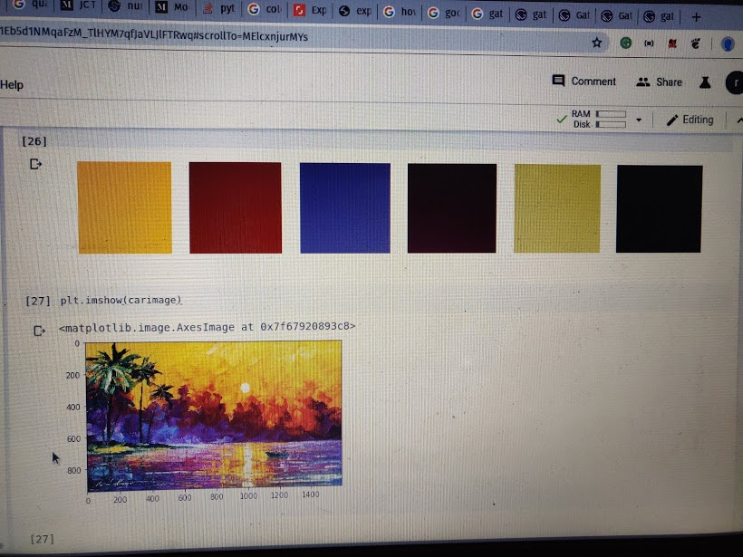

# Python Note Scanner
The main idea for this project is to convert a note shot taken from camera to a clear sharp readable pdf. 
Its basically what camscanner does i just wanted to do it myself as a project. 

### Motivation
Initially this wasn't the project i started with i wanted to create a color palette . I am trying to find a use case for Machine Learning algotihms and thought of creating a color palette generator which can be done by using kmeans on the rgb values. After i made it and see how eliminating colors that are not a part of palette gives a much sharp and clear picture i got this idea of creating this whole scanner app.

This is the color palette results

# Introduction
This section will guide you through the process as to how from an photo image we can get a clear image
The basice steps are
1. Get the image in rgb
2. Extract the background which in case of a note will be the most used color. 
3. Extract foreground. foreground is everything other than background here.
4. get the color palettes from the foreground. The colorpalette will basically remove the noises.
5. use this color palette. Apply the palette on the note to get a better version of the note.

